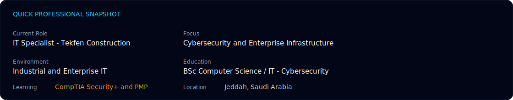
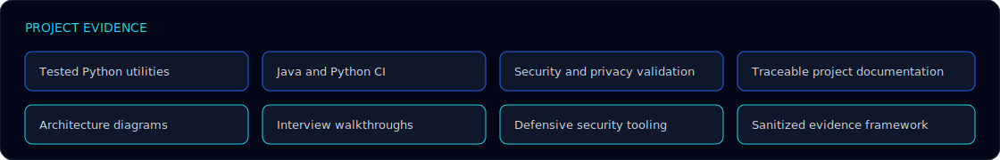
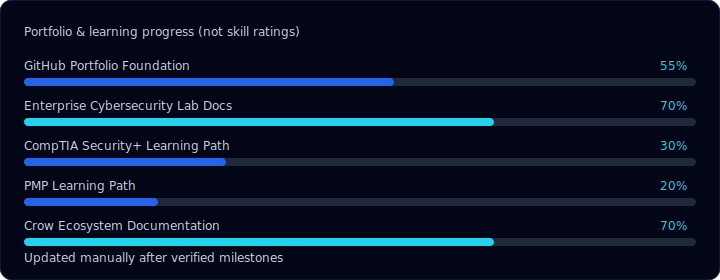
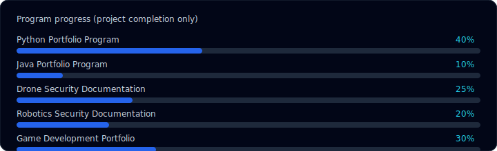
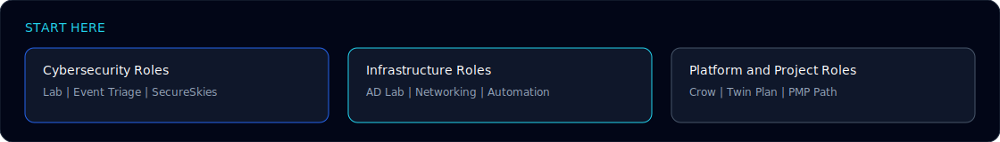

<!--
PROFILE CONFIGURATION

Name:
Muhanad Ghurab

GitHub Username:
MuhanadGhurab

GitHub URL:
https://github.com/MuhanadGhurab

LinkedIn:
https://www.linkedin.com/in/muhanad-ghurab-141btb414

Email:
muhanadghurab@gmail.com

Location:
Jeddah, Saudi Arabia

Current Role:
IT Specialist — Tekfen Construction

Professional Identity:
Cybersecurity • Infrastructure • Enterprise Technology

Security+ Status:
In Progress

PMP Status:
In Progress

GitHub Portfolio Foundation:
75%

Enterprise Cybersecurity Lab Documentation:
80%

Security+ Learning Path:
30%

PMP Learning Path:
20%

Crow Ecosystem Documentation:
70%

Python Portfolio Program:
55%

Security Toolset Program:
60%

Drone Security Documentation:
75%

SecureSkies Digital Twin:
0%

Java Portfolio Program:
10%

Robotics Security Documentation:
20%

Game Development Portfolio:
30%

Progress values describe project or learning completion only.
They are not competency percentages.

Update manually after verified milestones.
-->

# MUHANAD GHURAB

<p align="center">
  <picture>
    <source media="(prefers-reduced-motion: reduce)" srcset="./assets/cyber-crow-home-static.svg" />
    
  </picture>
</p>

<p align="center">
  <strong>Cybersecurity &amp; IT Infrastructure Specialist</strong><br/>
  <em>Securing Enterprise Systems. Building Resilient Infrastructure. Engineering Trusted Digital Operations.</em><br/>
  Jeddah, Saudi Arabia ·
  <a href="https://github.com/MuhanadGhurab">GitHub</a> ·
  <a href="https://www.linkedin.com/in/muhanad-ghurab-141btb414">LinkedIn</a> ·
  <a href="mailto:muhanadghurab@gmail.com">Email</a>
</p>

---

## Quick professional snapshot

<p align="center">
  
</p>

| | |
|---|---|
| **Current Role** | IT Specialist — Tekfen Construction |
| **Focus** | Cybersecurity and Enterprise Infrastructure |
| **Environment** | Industrial and Enterprise IT |
| **Education** | BSc Computer Science / IT — Cybersecurity |
| **Learning** | CompTIA Security+ and PMP — In Progress |
| **Location** | Jeddah, Saudi Arabia |

Supporting enterprise IT operations within a Tekfen Construction environment associated with Saudi Aramco projects. This is an **environment association** — not direct Aramco employment.

---

## Terminal introduction

```text
$ whoami
Muhanad Ghurab

$ current_role
IT Specialist — Tekfen Construction

$ operating_domain
Cybersecurity | Infrastructure | Enterprise Technology

$ building
Security labs | Defensive tools | Secure platforms

$ learning
CompTIA Security+ | PMP

$ location
Jeddah, Saudi Arabia
```

---

## Professional overview

Muhanad Ghurab is a Cybersecurity & IT Infrastructure Specialist supporting enterprise and industrial IT operations as an IT Specialist at Tekfen Construction. Day-to-day work centers on infrastructure reliability, endpoint support, and practical troubleshooting across networked systems in an environment associated with Saudi Aramco projects. His academic foundation is a Bachelor’s specialization in cybersecurity. Outside production duties, he builds privacy-controlled security labs, publishes tested defensive Python and Java utilities, documents SecureSkies as an honest university prototype, and develops secure platform and architecture artifacts. He is progressing through CompTIA Security+ and PMP to deepen security operations, governance, and delivery discipline.

---

## Featured work

### 1. Enterprise Cybersecurity Lab

Enterprise-style security and infrastructure laboratory covering Windows Server, Active Directory, Linux, segmentation, monitoring, and defensive analysis.

- **Status:** Active documentation and evidence development  
- **Evidence:** Architecture, security boundaries, [interview walkthrough](https://github.com/MuhanadGhurab/enterprise-cybersecurity-lab/blob/main/docs/INTERVIEW-WALKTHROUGH.md), sanitized [evidence framework](https://github.com/MuhanadGhurab/enterprise-cybersecurity-lab/tree/main/evidence) (real screenshots pending capture)  
- **Technologies:** Windows Server · Active Directory · VMware · Security Onion · Kali Linux · Ubuntu  
- **Repository:** [enterprise-cybersecurity-lab](https://github.com/MuhanadGhurab/enterprise-cybersecurity-lab)

### 2. SecureSkies — Drone Security Research

Four-person university project exploring Raspberry Pi, Pixhawk flight control, physical surveillance concepts, network monitoring, and alerting. Partially integrated prototype; **full autonomous deployment not completed**.

- **Status:** Public historical documentation complete; software digital twin planned  
- **Evidence:** Honest test summary (20 pass / 3 fail / 1 inconclusive), architecture reconstructions, publication boundaries  
- **Achievement:** Second Place — University Graduation Project · Owner-verified; supporting artifact pending  
- **Technologies:** Raspberry Pi · Pixhawk · Mission Planner · Wireshark · tcpdump  
- **Repository:** [secureskies-drone-security](https://github.com/MuhanadGhurab/secureskies-drone-security)

### 3. Mini IT and Cyber Projects

Defensive utilities for hashing, log summarization, IOC extraction, evidence manifests, and Windows event triage — with tests and CI.

- **Status:** Active development; Java and Python CI passing  
- **Evidence:** Tested tools, defensive-use boundaries, [interview walkthrough](https://github.com/MuhanadGhurab/mini-it-cyber-projects/blob/main/docs/INTERVIEW-WALKTHROUGH.md)  
- **Technologies:** Python · Java · pytest · GitHub Actions  
- **Repository:** [mini-it-cyber-projects](https://github.com/MuhanadGhurab/mini-it-cyber-projects)

### 4. Crow Ecosystem Platform

Public product and engineering portfolio for Crow ecosystem architecture and platform work.

- **Status:** Active development — public platform codebase  
- **Evidence:** Public repository architecture and product surface  
- **Technologies:** TypeScript · React · Next.js · platform engineering patterns  
- **Repository:** [crow-ecosystem-platform](https://github.com/MuhanadGhurab/crow-ecosystem-platform)

### 5. Windows Event Triage Helper

Defensive Python helper for structured Windows event triage practice and interview-ready evidence narratives.

- **Status:** Published with tests inside the mini-project suite  
- **Evidence:** Tool README + automated tests  
- **Technologies:** Python · Windows Event concepts · defensive analysis  
- **Path:** [windows_event_triage_helper](https://github.com/MuhanadGhurab/mini-it-cyber-projects/tree/main/python/windows_event_triage_helper)

### 6. Interview and Evidence Documentation

Cross-repository interview walkthroughs and privacy-controlled evidence frameworks that make the portfolio reviewable without production secrets.

- **Status:** Published documentation  
- **Evidence:** Lab and tool interview guides; sanitized evidence packing rules  
- **Links:** [Lab interview](https://github.com/MuhanadGhurab/enterprise-cybersecurity-lab/blob/main/docs/INTERVIEW-WALKTHROUGH.md) · [SecureSkies interview](https://github.com/MuhanadGhurab/secureskies-drone-security/blob/main/docs/portfolio/INTERVIEW-WALKTHROUGH.md)

---

## Project evidence

<p align="center">
  
</p>

- Tested Python utilities  
- Java and Python CI  
- Security and privacy validation  
- Traceable project documentation  
- Architecture diagrams  
- Interview walkthroughs  
- Defensive security tooling  
- Sanitized evidence framework  

Hard-coded “total passing tests” counts are intentionally omitted so the homepage stays maintainable.

---

## Technical capability matrix

Classification (optional): **Hands-On** · **Working Knowledge** · **Project Exposure** · **Currently Developing**

### Cybersecurity

Security Monitoring · Log Analysis · Security Hardening · Incident Response Fundamentals · Network Security · Identity and Access · Vulnerability Assessment Fundamentals · Risk Awareness

### Infrastructure

Windows Server · Active Directory · DNS · DHCP · Linux · VMware · Endpoint Support · Enterprise Troubleshooting

### Networking

TCP/IP · Segmentation · VLAN Concepts · Routing and Switching Fundamentals · Firewalls · Packet Analysis

### Tools

Security Onion · Kali Linux · Wireshark · Nmap · Git · GitHub · Microsoft 365

### Software and platform engineering

Python · Java · TypeScript · React · Next.js · Tailwind CSS · Prisma · PostgreSQL · Supabase · Playwright · Tauri

No skill percentages are published.

---

## Current operating status

<!-- Progress values = project/learning completion only. Sync from PROFILE CONFIGURATION. -->

<p align="center">
  
</p>

<p align="center">
  
</p>

| Program | Progress |
|---------|----------|
| GitHub Portfolio Foundation | 75% |
| Enterprise Cybersecurity Lab Documentation | 80% |
| Drone Security Documentation | 75% |
| SecureSkies Digital Twin | 0% — Planned |
| Python Portfolio Program | 55% |
| Security Toolset | 60% |
| Crow Ecosystem Documentation | 70% |
| CompTIA Security+ Learning Path | 30% |
| PMP Learning Path | 20% |

---

## Current learning

| Path | Status | Focus |
|------|--------|-------|
| **CompTIA Security+** | In Progress | Developing security fundamentals across threats, architecture, operations, risk, identity, and incident response. |
| **PMP** | In Progress | Developing structured project delivery, planning, risk, stakeholder, schedule, quality, and governance capabilities. |

No exam eligibility or completion claims are published until verified by the owner.

---

## Selected achievements

- **Second Place — University Graduation Project** (SecureSkies) — Owner-verified; supporting artifact pending  
- Built an enterprise cybersecurity laboratory with privacy-controlled documentation  
- Published tested defensive security tools (Python/Java) with CI  
- Supporting enterprise IT operations at Tekfen Construction  
- Developed Crow Ecosystem architecture and platform work (subject to public/private repository boundaries)

---

## Start Here

<p align="center">
  
</p>

### For cybersecurity roles

1. [Enterprise Cybersecurity Lab](https://github.com/MuhanadGhurab/enterprise-cybersecurity-lab)  
2. [Windows Event Triage Helper](https://github.com/MuhanadGhurab/mini-it-cyber-projects/tree/main/python/windows_event_triage_helper)  
3. [SecureSkies security review](https://github.com/MuhanadGhurab/secureskies-drone-security)

### For infrastructure roles

1. [Windows Server and Active Directory lab docs](https://github.com/MuhanadGhurab/enterprise-cybersecurity-lab)  
2. Networking and systems documentation inside the lab repository  
3. [IT automation / defensive utilities](https://github.com/MuhanadGhurab/mini-it-cyber-projects)

### For platform and project roles

1. [Crow Ecosystem Platform](https://github.com/MuhanadGhurab/crow-ecosystem-platform)  
2. [SecureSkies modernization plan](https://github.com/MuhanadGhurab/secureskies-drone-security/blob/main/docs/modern/DIGITAL-TWIN-PLAN.md)  
3. PMP development path (In Progress)

---

## Contact

Open to opportunities involving cybersecurity, enterprise IT infrastructure, security operations, secure platform engineering, automation, and technical project delivery.

- GitHub: [github.com/MuhanadGhurab](https://github.com/MuhanadGhurab)  
- LinkedIn: [muhanad-ghurab-141btb414](https://www.linkedin.com/in/muhanad-ghurab-141btb414)  
- Email: [muhanadghurab@gmail.com](mailto:muhanadghurab@gmail.com)

---

<details>
<summary>Maintainer notes</summary>

- Homepage docs: [`docs/HOMEPAGE-ARCHITECTURE.md`](docs/HOMEPAGE-ARCHITECTURE.md) · [`docs/HOMEPAGE-MAINTENANCE.md`](docs/HOMEPAGE-MAINTENANCE.md)  
- Brand: [`docs/BRAND-GUIDE.md`](docs/BRAND-GUIDE.md) · Privacy: [`docs/PRIVACY-BOUNDARIES.md`](docs/PRIVACY-BOUNDARIES.md)  
- Progress values update manually only — never invent metrics  

</details>
