<!--
PROFILE CONFIGURATION

Name:
Muhanad Ghurab

GitHub Username:
MuhanadGhurab

GitHub URL:
https://github.com/MuhanadGhurab

LinkedIn:
https://www.linkedin.com/in/muhanad-ghurab-141btb414

Email:
muhanadghurab@gmail.com

Location:
Jeddah, Saudi Arabia

Current Role:
IT Specialist — Tekfen Construction

Professional Identity:
Cybersecurity • Infrastructure • Enterprise Technology

Security+ Status:
In Progress

PMP Status:
In Progress

GitHub Portfolio Foundation:
60%

Enterprise Cybersecurity Lab Documentation:
80%

Security+ Learning Path:
30%

PMP Learning Path:
20%

Crow Ecosystem Documentation:
70%

Python Portfolio Program:
55%

Java Portfolio Program:
10%

Security Toolset Program:
60%

Drone Security Documentation:
75%

SecureSkies Digital Twin:
0%

Robotics Security Documentation:
20%

Game Development Portfolio:
30%

Progress values describe project or learning completion only.
They are not competency percentages.

Update manually after verified milestones.
-->

# MUHANAD GHURAB

<p align="center">
  <picture>
    <source media="(prefers-reduced-motion: reduce)" srcset="./assets/cyber-crow-static.svg" />
    
  </picture>
</p>

<p align="center">
  <strong>Cybersecurity &amp; IT Infrastructure Specialist</strong><br/>
  <em>Securing Enterprise Systems. Building Resilient Infrastructure. Engineering Trusted Digital Operations.</em>
</p>

<p align="center">
  Jeddah, Saudi Arabia<br/>
  <a href="https://github.com/MuhanadGhurab">GitHub</a> ·
  <a href="https://www.linkedin.com/in/muhanad-ghurab-141btb414">LinkedIn</a> ·
  <a href="mailto:muhanadghurab@gmail.com">Email</a>
</p>

<p align="center">
  
</p>

## Terminal identity

```text
$ whoami
Muhanad Ghurab

$ role
IT Specialist — Tekfen Construction

$ domain
Cybersecurity | Infrastructure | Enterprise Technology

$ current_focus
Lab Evidence Framework | Event Triage Tooling | Interview Walkthroughs

$ learning
CompTIA Security+ | PMP

$ location
Jeddah, Saudi Arabia
```

<p align="center">
  
</p>

## Professional overview

Muhanad Ghurab is a Cybersecurity & IT Infrastructure Specialist with a Bachelor’s background in Computer Science / IT specializing in Cybersecurity. He currently works as an IT Specialist at Tekfen Construction, supporting enterprise and industrial IT operations within an environment associated with Saudi Aramco projects. His day-to-day focus includes infrastructure support, endpoint reliability, and practical troubleshooting across networked systems.

Outside production work, he develops home-lab security environments, builds defensive automation and learning projects, and documents architectures with clear privacy boundaries. He is currently progressing through CompTIA Security+ and PMP learning paths, and continues expanding a public GitHub portfolio around cybersecurity, infrastructure, Python, Java, and secure platform engineering.

## Professional highlights

- **IT Specialist — Tekfen Construction**
- Enterprise and industrial IT exposure
- Saudi Aramco project-environment exposure (environment association — not direct Aramco employment)
- Bachelor’s specialization in Cybersecurity
- **Second Place — University Graduation Project** (SecureSkies) — Owner-verified; supporting artifact pending.
- Enterprise Cybersecurity Lab (evidence framework + interview walkthrough; screenshots pending capture)
- Defensive security toolset (IOC extractor, evidence manifest builder, Windows event triage helper)
- Crow Ecosystem Platform (public product/engineering portfolio)
- CompTIA Security+ — In Progress
- PMP — In Progress

## Current operating status

<!--
Progress values describe project or learning completion only.
They do not represent competency ratings.
Update manually after completing verified milestones.
-->

<p align="center">
  
</p>

<p align="center">
  
</p>

| Program | Progress |
|---------|----------|
| GitHub Portfolio Foundation | 60% |
| Enterprise Cybersecurity Lab Documentation | 80% |
| CompTIA Security+ Learning Path | 30% |
| PMP Learning Path | 20% |
| Crow Ecosystem Documentation | 70% |
| Python Portfolio Program | 55% |
| Security Toolset Program | 60% |
| Java Portfolio Program | 10% |
| Drone Security Documentation | 75% |
| SecureSkies Digital Twin | 0% (Planned) |
| Robotics Security Documentation | 20% |
| Game Development Portfolio | 30% |

## Featured portfolio

| # | Area | Repository | Status |
|---|------|------------|--------|
| 1 | Crow Ecosystem Platform | [crow-ecosystem-platform](https://github.com/MuhanadGhurab/crow-ecosystem-platform) | Active Development — public platform codebase |
| 2 | Enterprise Cybersecurity Lab | [enterprise-cybersecurity-lab](https://github.com/MuhanadGhurab/enterprise-cybersecurity-lab) | Active Documentation — [evidence framework](https://github.com/MuhanadGhurab/enterprise-cybersecurity-lab/tree/main/evidence) · [interview walkthrough](https://github.com/MuhanadGhurab/enterprise-cybersecurity-lab/blob/main/docs/INTERVIEW-WALKTHROUGH.md) |
| 3 | Small IT & Cyber Projects | [mini-it-cyber-projects](https://github.com/MuhanadGhurab/mini-it-cyber-projects) | Active Development — [event triage](https://github.com/MuhanadGhurab/mini-it-cyber-projects/tree/main/python/windows_event_triage_helper) · [IOC extractor](https://github.com/MuhanadGhurab/mini-it-cyber-projects/tree/main/python/ioc_text_extractor) · [evidence manifest](https://github.com/MuhanadGhurab/mini-it-cyber-projects/tree/main/python/evidence_manifest_builder) |
| 4 | SecureSkies — Drone Security Research and Academic Prototype | [secureskies-drone-security](https://github.com/MuhanadGhurab/secureskies-drone-security) | Historical documentation published — partially integrated prototype; full autonomous deployment not completed · Second Place (owner-verified; artifact pending) |
| 5 | Smart Methods Robotics Notes | Planned documentation | Planning |
| 6 | Security Automation Toolkit | Planned | Planning |
| 7 | Python Engineering Program | Started inside mini-it-cyber-projects | Scaffolded |
| 8 | Java Engineering Program | Started inside mini-it-cyber-projects | Scaffolded |
| 9 | Desktop Apps & Games | Planned portfolio summaries | Planning |
| 10 | Technical Docs & Architecture | Profile docs + lab + Crow README | Active Development |

> Planned repositories are listed honestly and are **not** linked until public content exists.

## Technical capabilities

Classification key: **Hands-On** · **Working Knowledge** · **Project Exposure** · **Currently Developing**

### Cybersecurity

Security Monitoring · Log Analysis · Security Hardening · Incident Response Fundamentals · Vulnerability Assessment Fundamentals · Network Security · Identity and Access Management · Risk Awareness · Security Architecture Fundamentals · Secure Configuration

### Infrastructure

Windows Server · Active Directory · DNS · DHCP · Linux · VMware Workstation Pro · Endpoint Support · System Administration · Enterprise Troubleshooting · Technical Documentation

### Networking

TCP/IP · Network Segmentation · VLAN Concepts · Routing and Switching Fundamentals · Firewall Configuration · Network Diagnostics · Secure Connectivity · Packet Analysis

### Security and administration tools

Kali Linux · Security Onion · Wireshark · Nmap · Git · GitHub · Microsoft 365 · Windows Administration · Linux Command Line

### Software and platform engineering

Python · Java · JavaScript · TypeScript · React · Next.js · Tailwind CSS · Prisma · PostgreSQL · Supabase · Vercel · Playwright · Tauri

### Project and governance development

PMP Learning Path · Technical Documentation · Risk Awareness · IT Process Improvement · Security Governance Interest · Enterprise Architecture Interest · Change Control Awareness · Incremental Delivery

## Current learning

| Credential / path | Status |
|-------------------|--------|
| CompTIA Security+ | In Progress |
| Project Management Professional (PMP) | In Progress |

No expected completion dates are published until confirmed by the owner.

## GitHub metrics

Public activity reflects real commits and real repositories only. No fabricated stars, streaks, or contribution graphs are mirrored here.

- Profile: [github.com/MuhanadGhurab](https://github.com/MuhanadGhurab)
- Primary public platform repository: [crow-ecosystem-platform](https://github.com/MuhanadGhurab/crow-ecosystem-platform)
- Lab evidence: [enterprise-cybersecurity-lab docs](https://github.com/MuhanadGhurab/enterprise-cybersecurity-lab/tree/main/docs) · [evidence/](https://github.com/MuhanadGhurab/enterprise-cybersecurity-lab/tree/main/evidence)
- Defensive tools: [mini-it-cyber-projects](https://github.com/MuhanadGhurab/mini-it-cyber-projects) · [tool interview notes](https://github.com/MuhanadGhurab/mini-it-cyber-projects/blob/main/docs/INTERVIEW-WALKTHROUGH.md)
- SecureSkies historical portfolio: [secureskies-drone-security](https://github.com/MuhanadGhurab/secureskies-drone-security)

## Contact

Open to opportunities involving cybersecurity, enterprise IT infrastructure, security operations, secure platform engineering, automation, and technical project delivery.

- LinkedIn: [muhanad-ghurab-141btb414](https://www.linkedin.com/in/muhanad-ghurab-141btb414)
- Email: [muhanadghurab@gmail.com](mailto:muhanadghurab@gmail.com)
- GitHub: [MuhanadGhurab](https://github.com/MuhanadGhurab)
- Portfolio URL: *planned* (not registered)

---

<details>
<summary>Portfolio program notes</summary>

- This profile repository is documentation and identity only — not an application.
- Progress values are updated only after verified milestones.
- Company, client, and production details are never published. See [`docs/PRIVACY-BOUNDARIES.md`](docs/PRIVACY-BOUNDARIES.md).
- Brand system: [`docs/BRAND-GUIDE.md`](docs/BRAND-GUIDE.md)
- Roadmap: [`docs/PORTFOLIO-ROADMAP.md`](docs/PORTFOLIO-ROADMAP.md)
- Inventory: [`docs/PROJECT-INVENTORY.md`](docs/PROJECT-INVENTORY.md)

</details>
