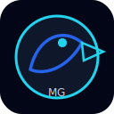
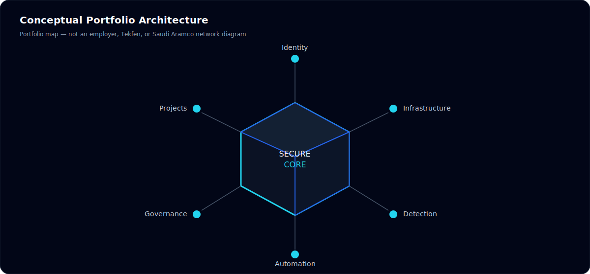
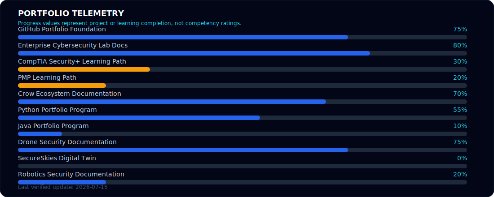
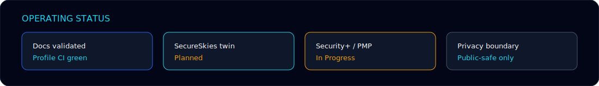
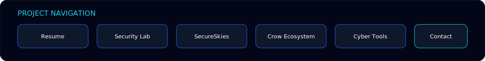

<!--
PROFILE CONFIGURATION

Name:
Muhanad Ghurab

GitHub Username:
MuhanadGhurab

GitHub URL:
https://github.com/MuhanadGhurab

LinkedIn:
https://www.linkedin.com/in/muhanad-ghurab-141btb414

Email:
muhanadghurab@gmail.com

Location:
Jeddah, Saudi Arabia

Current Role:
IT Specialist — Tekfen Construction

Professional Identity:
Cybersecurity • Infrastructure • Enterprise Technology

Primary Title:
Cybersecurity & IT Infrastructure Specialist

Security+ Status:
In Progress

PMP Status:
In Progress

Approved ATS Resume:
resume/Muhanad-Ghurab-ATS-Resume.pdf

Progress Source:
data/profile-status.json

Progress values represent project or learning completion only.
They do not represent competency percentages.

Do not display unresolved values.
-->

<h1 align="center">Muhanad Ghurab</h1>

<p align="center">
  <picture>
    <source media="(prefers-reduced-motion: reduce)" srcset="./assets/profile/cyber-crow-command-center-static.svg" />
    
  </picture>
</p>

<h3 align="center">Cybersecurity • Infrastructure • Enterprise Technology</h3>

<p align="center">
Securing enterprise systems, building resilient infrastructure,<br/>
and engineering trusted digital operations.
</p>

<p align="center">
  <a href="./resume/Muhanad-Ghurab-ATS-Resume.pdf"></a>
  <a href="https://github.com/MuhanadGhurab?tab=repositories"></a>
  <a href="https://www.linkedin.com/in/muhanad-ghurab-141btb414"></a>
  <a href="mailto:muhanadghurab@gmail.com"></a>
  <a href="https://github.com/MuhanadGhurab/enterprise-cybersecurity-lab"></a>
  <a href="https://github.com/MuhanadGhurab/crow-ecosystem-platform"></a>
</p>

<p align="center">
  
</p>

---

## Terminal status

```text
$ whoami
Muhanad Ghurab

$ role
IT Specialist — Tekfen Construction

$ focus
Cybersecurity | Enterprise Infrastructure | Secure Platforms

$ building
Security Labs | Automation | Technical Portfolio

$ learning
CompTIA Security+ | PMP

$ location
Jeddah, Saudi Arabia
```

---

## Professional overview

Muhanad Ghurab is a Cybersecurity & IT Infrastructure Specialist supporting enterprise and industrial IT operations as an IT Specialist at Tekfen Construction. His work centers on infrastructure reliability, endpoint support, and practical troubleshooting across networked systems in an environment associated with Saudi Aramco projects. With a Bachelor’s specialization in cybersecurity, he builds privacy-controlled security labs, publishes tested defensive Python and Java utilities, documents SecureSkies as an honest university prototype, and develops secure-platform architecture artifacts. He is progressing through CompTIA Security+ and PMP to strengthen security operations and delivery discipline.

---

## 📄 Resume

Cybersecurity and IT Infrastructure Specialist with enterprise-environment experience, practical cybersecurity projects, and active development through CompTIA Security+ and PMP studies.

<p align="center">
  <a href="./resume/Muhanad-Ghurab-ATS-Resume.pdf"></a>
  <a href="https://github.com/MuhanadGhurab/MuhanadGhurab/raw/main/resume/Muhanad-Ghurab-ATS-Resume.pdf"></a>
  <a href="https://www.linkedin.com/in/muhanad-ghurab-141btb414"></a>
  <a href="https://github.com/MuhanadGhurab"></a>
</p>

Editable DOCX and ATS checklist: [`resume/README.md`](resume/README.md)

---

## 🛡️ Professional Highlights

- **IT Specialist — Tekfen Construction**
- Enterprise and industrial IT environment exposure
- Supporting enterprise IT operations within a Tekfen Construction environment associated with Saudi Aramco projects
- Bachelor’s specialization in Cybersecurity
- **Second Place — University Graduation Project** (SecureSkies) — Owner-verified; supporting artifact pending
- Enterprise Cybersecurity Lab
- Crow Ecosystem Platform
- CompTIA Security+ — In Progress
- PMP — In Progress

---

## 🧭 Conceptual Portfolio Architecture

<p align="center">
  
</p>

This diagram is a **conceptual map of the public portfolio domains**. It is not an employer network, Tekfen architecture, or Saudi Aramco production diagram.

---

## 📈 Current Development

<p align="center">
  
</p>

**Project and learning progress — not competency ratings.**
Source: [`data/profile-status.json`](data/profile-status.json)

<p align="center">
  
</p>

---

## 🧪 Featured Projects

<p align="center">
  
</p>

| Project | Status | Link |
|---------|--------|------|
| Crow Ecosystem Platform | Active Development | [crow-ecosystem-platform](https://github.com/MuhanadGhurab/crow-ecosystem-platform) |
| Enterprise Cybersecurity Lab | Active Documentation | [enterprise-cybersecurity-lab](https://github.com/MuhanadGhurab/enterprise-cybersecurity-lab) |
| SecureSkies Drone Security | Historical docs complete; twin planned | [secureskies-drone-security](https://github.com/MuhanadGhurab/secureskies-drone-security) |
| Mini IT and Cyber Projects | Active Development · CI | [mini-it-cyber-projects](https://github.com/MuhanadGhurab/mini-it-cyber-projects) |
| Windows Event Triage Helper | Published utility | [path](https://github.com/MuhanadGhurab/mini-it-cyber-projects/tree/main/python/windows_event_triage_helper) |
| Smart Methods Robotics | Planned | Planned |
| Security Automation Toolkit | Planned | Planned |
| Desktop Applications | Planned | Planned |
| Cyber Learning Games | Planned | Planned |

SecureSkies status: partially integrated academic prototype; **full autonomous deployment not completed**.

---

## ⚙️ Technical Capabilities

Classification: **Hands-On** · **Working Knowledge** · **Project Exposure** · **Currently Developing**

### Cybersecurity
Security Monitoring · Log Analysis · Security Hardening · Incident Response Fundamentals · Network Security · Identity and Access · Vulnerability Assessment Fundamentals · Risk Awareness

### Infrastructure
Windows Server · Active Directory · DNS · DHCP · Linux · VMware · Endpoint Support · Enterprise Troubleshooting

### Networking
TCP/IP · Segmentation · VLAN Concepts · Routing and Switching Fundamentals · Firewalls · Packet Analysis

### Security Tools
Security Onion · Kali Linux · Wireshark · Nmap · Git · GitHub · Microsoft 365

### Platform Engineering
Python · Java · TypeScript · React · Next.js · Tailwind CSS · Prisma · PostgreSQL · Supabase · Playwright · Tauri

No skill percentages are published.

---

## 🧠 Learning Tracks

| Track | Status | Notes |
|-------|--------|-------|
| CompTIA Security+ | In Progress | Threats, architecture, operations, risk, identity, incident response fundamentals |
| PMP | In Progress | Planning, risk, stakeholders, schedule, quality, governance |

No exam eligibility or completion claims are published until verified.

---

## 📊 GitHub Evidence

Public activity reflects real commits and real repositories only. No fabricated stars, streaks, or contribution totals are mirrored here.

- Profile: [github.com/MuhanadGhurab](https://github.com/MuhanadGhurab)
- Lab: [enterprise-cybersecurity-lab](https://github.com/MuhanadGhurab/enterprise-cybersecurity-lab)
- SecureSkies: [secureskies-drone-security](https://github.com/MuhanadGhurab/secureskies-drone-security)
- Tools: [mini-it-cyber-projects](https://github.com/MuhanadGhurab/mini-it-cyber-projects)
- Crow: [crow-ecosystem-platform](https://github.com/MuhanadGhurab/crow-ecosystem-platform)

<details>
<summary>Maintainer notes</summary>

- Render telemetry: `python scripts/render-profile-assets.py`
- Design decision: [`docs/HERO-DESIGN-DECISION.md`](docs/HERO-DESIGN-DECISION.md)
- Compatibility: [`docs/GITHUB-COMPATIBILITY.md`](docs/GITHUB-COMPATIBILITY.md)
- Brand: [`docs/BRAND-GUIDE.md`](docs/BRAND-GUIDE.md)

</details>

---

## 📫 Contact

Open to opportunities involving cybersecurity, enterprise IT infrastructure, security operations, secure platform engineering, automation, and technical project delivery.

- GitHub: [https://github.com/MuhanadGhurab](https://github.com/MuhanadGhurab)
- LinkedIn: [https://www.linkedin.com/in/muhanad-ghurab-141btb414](https://www.linkedin.com/in/muhanad-ghurab-141btb414)
- Email: [muhanadghurab@gmail.com](mailto:muhanadghurab@gmail.com)
