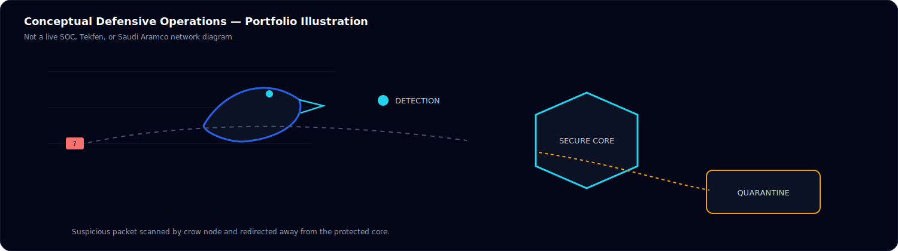
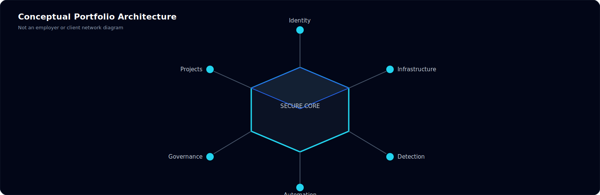
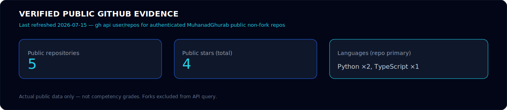
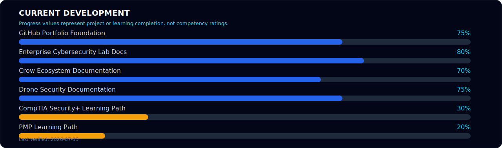
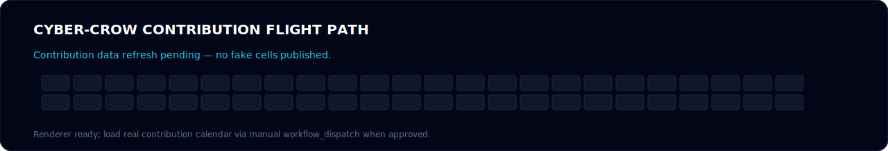

<!--
PROFILE CONFIGURATION

Name:
Muhanad Ghurab

GitHub Username:
MuhanadGhurab

GitHub URL:
https://github.com/MuhanadGhurab

LinkedIn:
https://www.linkedin.com/in/muhanad-ghurab-141btb414

Email:
muhanadghurab@gmail.com

Location:
Jeddah, Saudi Arabia

Current Role:
IT Specialist — Tekfen Construction

Professional Identity:
Cybersecurity • Infrastructure • Enterprise Technology

Primary Title:
Cybersecurity & IT Infrastructure Specialist

Security+ Status:
In Progress

PMP Status:
In Progress

Approved ATS Resume:
resume/Muhanad-Ghurab-ATS-Resume.pdf

Progress Source:
data/profile-status.json

GitHub Evidence:
data/github-evidence.json

Progress values represent project or learning completion only.
They do not represent competency percentages.

Do not display unresolved values.
-->

<p align="center">
  <picture>
    <source media="(prefers-reduced-motion: reduce)" srcset="./assets/profile/cyber-crow-hero-v2-static.svg" />
    
  </picture>
</p>

<h1 align="center">Muhanad Ghurab</h1>

<h3 align="center">
Cybersecurity • Infrastructure • Enterprise Technology
</h3>

<p align="center">
Securing enterprise systems. Building resilient infrastructure.<br/>
Engineering trusted digital operations.
</p>

<p align="center">
  <a href="./resume/Muhanad-Ghurab-ATS-Resume.pdf"></a>
  <a href="https://www.linkedin.com/in/muhanad-ghurab-141btb414"></a>
  <a href="mailto:muhanadghurab@gmail.com"></a>
  <a href="https://github.com/MuhanadGhurab/enterprise-cybersecurity-lab"></a>
  <a href="https://github.com/MuhanadGhurab/secureskies-drone-security"></a>
  <a href="https://github.com/MuhanadGhurab/crow-ecosystem-platform"></a>
</p>

```console
$ whoami
Muhanad Ghurab

$ role
IT Specialist — Tekfen Construction

$ focus
Cybersecurity | Enterprise Infrastructure | Secure Platforms

$ building
Security Labs | Automation | Technical Projects

$ learning
CompTIA Security+ | PMP
```

---

## 📄 Resume

Cybersecurity & IT Infrastructure Specialist with enterprise-environment experience, practical cybersecurity projects, and active CompTIA Security+ and PMP study.

<p align="center">
  <a href="./resume/Muhanad-Ghurab-ATS-Resume.pdf"></a>
  <a href="https://github.com/MuhanadGhurab/MuhanadGhurab/raw/main/resume/Muhanad-Ghurab-ATS-Resume.pdf"></a>
  <a href="https://github.com/MuhanadGhurab/MuhanadGhurab/raw/main/resume/Muhanad-Ghurab-ATS-Resume.docx"></a>
  <a href="https://www.linkedin.com/in/muhanad-ghurab-141btb414"></a>
</p>

Details and ATS checklist: [`resume/README.md`](resume/README.md)

---

## 🛰️ Current Mission

Muhanad Ghurab is a Cybersecurity & IT Infrastructure Specialist supporting enterprise and industrial IT operations as an IT Specialist at Tekfen Construction. His work centers on infrastructure reliability, endpoint support, and practical troubleshooting across networked systems in an environment associated with Saudi Aramco projects.

With a Bachelor’s specialization in cybersecurity, he builds privacy-controlled security labs, publishes tested defensive utilities, documents SecureSkies as an honest university prototype, and develops secure-platform architecture artifacts. He is progressing through CompTIA Security+ and PMP to strengthen security operations and delivery discipline.

<p align="center">
  
</p>

---

## 🛡️ Professional Highlights

- **IT Specialist — Tekfen Construction**
- Supporting enterprise IT operations within a Tekfen Construction environment associated with Saudi Aramco projects
- Bachelor’s specialization in Cybersecurity
- **Second Place — University Graduation Project** (SecureSkies) — Owner-verified; supporting artifact pending
- Crow Ecosystem Platform · Enterprise Cybersecurity Lab · SecureSkies documentation
- CompTIA Security+ — In Progress
- PMP — In Progress

---

## 🧪 Featured Projects

### Primary featured

| Project | Purpose | Status | Focus | Link |
|---------|---------|--------|-------|------|
| Crow Ecosystem Platform | Secure multi-role ecosystem platform architecture and docs | Active Development | Secure platforms | [repo](https://github.com/MuhanadGhurab/crow-ecosystem-platform) |
| Enterprise Cybersecurity Lab | Privacy-controlled lab documentation and defensive practices | Active Documentation | Monitoring · hardening | [repo](https://github.com/MuhanadGhurab/enterprise-cybersecurity-lab) |
| SecureSkies Drone Security | University drone-security prototype documentation | Documentation Complete | Drone security concepts | [repo](https://github.com/MuhanadGhurab/secureskies-drone-security) |

SecureSkies: partially integrated academic prototype; **full autonomous deployment not completed**.

### Secondary portfolio

| Project | Status | Link |
|---------|--------|------|
| Mini IT & Cyber Projects | Active Development · CI | [mini-it-cyber-projects](https://github.com/MuhanadGhurab/mini-it-cyber-projects) |
| Security Automation | Planned | Planned |
| Python Engineering | Active Development | via mini / crow tracks |
| Java Engineering | Scaffolded | Planned expansion |
| Robotics Security | Planning | Planned |
| Desktop Applications | Planning | Planned |
| Cyber Learning Games | Planning | Planned |

---

## 🧭 Portfolio Architecture

<p align="center">
  
</p>

Conceptual map of **public portfolio domains** only. Not an employer network, Tekfen architecture, or Saudi Aramco production diagram.

---

## Enterprise Portfolio Programs

Governed six-program cyber-resilience portfolio (synthetic Northstar Industrial Services case material where noted). Operating system and first foundation packs:

| Program | Focus | Evidence home |
|---------|-------|---------------|
| Portfolio OS | Registries, evidence ledger, career gate | [enterprise-cyber-resilience-portfolio](https://github.com/MuhanadGhurab/enterprise-cyber-resilience-portfolio) |
| P3 Risk & GRC | Synthetic risk strategy and register | [enterprise-cyber-risk-governance](https://github.com/MuhanadGhurab/enterprise-cyber-risk-governance) |
| P5 Delivery | Synthetic security modernization program | [secure-project-delivery-office](https://github.com/MuhanadGhurab/secure-project-delivery-office) |
| P4 Engineering | Secure platform flagship | [crow-ecosystem-platform](https://github.com/MuhanadGhurab/crow-ecosystem-platform) |
| P1 / P2 Operations & Defense | Lab + defensive utilities | [enterprise-cybersecurity-lab](https://github.com/MuhanadGhurab/enterprise-cybersecurity-lab) · [mini-it-cyber-projects](https://github.com/MuhanadGhurab/mini-it-cyber-projects) |
| P6 Emerging systems | Academic drone-security case study | [secureskies-drone-security](https://github.com/MuhanadGhurab/secureskies-drone-security) |

Alignment case studies only — not certification or compliance claims. CompTIA Security+ and PMP remain **In Progress**.

---

## ⚙️ Technical Capabilities

Grouped skills in use — no competency percentages.

### 🛡️ Cybersecurity


### ⚙️ Infrastructure


### 💻 Engineering


### 📋 Delivery and Governance


<details>
<summary>Additional working areas</summary>

Networking fundamentals · VLAN concepts · firewalls · packet analysis · endpoint support · incident response fundamentals · identity and access concepts · vulnerability assessment fundamentals

</details>

---

## 📊 Verified GitHub Evidence

Verified public GitHub evidence — last refreshed **2026-07-15**.

<p align="center">
  
</p>

Source: [`data/github-evidence.json`](data/github-evidence.json) · refresh locally with `python scripts/update-github-evidence.py`

- Public repositories (non-fork): **5**
- Public stars (total): **4**
- Primary languages (repo count): Python ×2 · TypeScript ×1
- Highlighted public repos: Crow · Lab · SecureSkies · Mini tools · Profile

No fabricated grades, streaks, or commit-quality scores.

---

## 📈 Current Development

<p align="center">
  
</p>

**Project and learning progress — not competency ratings.**
Source: [`data/profile-status.json`](data/profile-status.json) · last verified 2026-07-15

<details>
<summary>Additional tracks</summary>

| Track | Value | Status |
|-------|-------|--------|
| Python Portfolio Program | 55% | Active Development |
| Security Toolset Program | 60% | Active Development |
| Game Development Portfolio | 30% | Planning |
| Robotics Security Documentation | 20% | Planning |
| Java Portfolio Program | 10% | Scaffolded |
| SecureSkies Digital Twin | 0% | Planned |

</details>

---

## 🐦 Cyber-Crow Flight Path

Original contribution visualization concept for this portfolio — **not** a third-party snake animation.

<p align="center">
  <picture>
    <source media="(prefers-reduced-motion: reduce)" srcset="./assets/generated/cyber-crow-contribution-flight-static.svg" />
    
  </picture>
</p>

Contribution calendar cells are **not fabricated**. Grid animation activates only after a manual owner-approved refresh of real public contribution data.

---

## 📫 Contact

Open to opportunities in cybersecurity, enterprise IT infrastructure, security operations, secure platform engineering, automation, and technical project delivery.

- GitHub: [https://github.com/MuhanadGhurab](https://github.com/MuhanadGhurab)
- LinkedIn: [https://www.linkedin.com/in/muhanad-ghurab-141btb414](https://www.linkedin.com/in/muhanad-ghurab-141btb414)
- Email: [muhanadghurab@gmail.com](mailto:muhanadghurab@gmail.com)

<details>
<summary>Maintainer notes</summary>

- Generate PROFILE.3 panels: `python scripts/generate_profile3_assets.py`
- Refresh evidence JSON: `python scripts/update-github-evidence.py`
- Reference study: [`docs/REFERENCE-STUDY-TROYMITCHELL911.md`](docs/REFERENCE-STUDY-TROYMITCHELL911.md)
- Animation decision: [`docs/ANIMATION-REBUILD-DECISION.md`](docs/ANIMATION-REBUILD-DECISION.md)
- Brand: [`docs/BRAND-GUIDE.md`](docs/BRAND-GUIDE.md)

</details>
